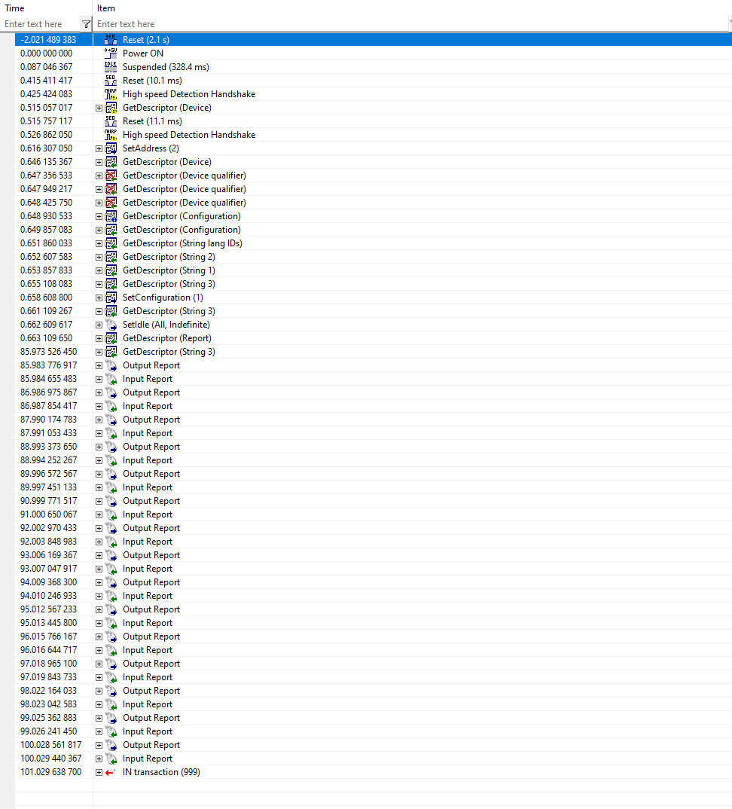

# Bug in the Raspberry 4 USB stack
A simple program to exhibit a bug in the USB stack  of the Raspberry Pi 4.

## Description of the Bug

We produce USB 2.0 devices that work at Full Speed (not High Speed) and use two interrupt endpoints. See [http://www.yoctopuce.com]. Our devices are declared as HID devices that use a Vendor specific protocol. Our open source library use the libUSB 1.0 to communicate with our devices.

We tested and used all Raspberry Pi devices since their apparition on on market. But we discovered that official Raspbian on a Raspberry Pi 4 don't work with our devices any more.

After some investigations we found out that device->host USB packets are not reported correctly by the libUSB. Using an USB analyser we can see that all packet are correctly sent (they are ACKed by the USB Host controller), but in the application the configured callback never get called.

We have not been able to determine if the issue is in the libUSB or the Linux kernel. But we have write a simple program exhibits the problem. It's a simple threaded example that iterates over all Yoctopuce connected devices and send 15 USB packets. For each sent packet the device with respond with an USB Packet.

If this binary is run on a Raspberry PI 2 or 3 everything run smoothly, but  if it is executed on a Raspberry PI 4 the libUSB never report incoming USB packet.


## Steps to compile this program

First clone this repository on your Raspberry PI Zero.
```
git clone https://github.com/yoctopuce-examples/raspberry_4_usb_bug.git
```

Install libUSB 1.0 headers.

```
sudo apt-get install libusb-1.0-0-dev
```

Compile the file program with the following command

```
gcc bug_usb_pi4.c -o bug_usb_pi4 -lusb-1.0
```

Run the example as root
```
sudo ./bug_usb_pi4
```

### Execution on a Rapberry Pi 4 (exhibit BUG)

```
pi@raspberrypi:~/raspberry_4_usb_bug $ sudo ./bug_usb_pi4
this is a simple program that exhibit a bug in the USB stack
of the Raspberry PI Zero and any Yoctopuce device
Use libUSB v1.0.22.11312
List all Yoctopuce devices present on this host:
 - USB dev: VOLTAGE1-1DCAC (24E0:1B:0)
1 Yoctopuce devices are present
\ Test device VOLTAGE1-1DCAC (24E0:1B)
- need to detach kernel driver
+ Send USB pkt no 0
+ Send USB pkt no 1
+ Send USB pkt no 2
+ Send USB pkt no 3
+ Send USB pkt no 4
+ Send USB pkt no 5
+ Send USB pkt no 6
+ Send USB pkt no 7
+ Send USB pkt no 8
+ Send USB pkt no 9
+ Send USB pkt no 10
+ Send USB pkt no 11
+ Send USB pkt no 12
+ Send USB pkt no 13
+ Send USB pkt no 14
= result: 15 pkt sent vs 0 pkt received
!!! ERROR : 15 packets missing !!!
Cancel and free all pending transactions
pi@raspberrypi:~/raspberry_4_usb_bug $
```

But if we look on the USB analyser there is 15 packets sent by the device.


### Execution on a Rapberry Pi 2 (Working)

If we run the exact same image on a Raspberry Pi 2 everything is working correctly:

```
pi@raspberrypi:~/raspberry_4_usb_bug $ sudo ./bug_usb_pi4
this is a simple program that exhibit a bug in the USB stack
of the Raspberry PI Zero and any Yoctopuce device
Use libUSB v1.0.22.11312
List all Yoctopuce devices present on this host:
 - USB dev: VOLTAGE1-1DCAC (24E0:1B:0)
1 Yoctopuce devices are present
\ Test device VOLTAGE1-1DCAC (24E0:1B)
- need to detach kernel driver
+ Send USB pkt no 0
- rd_callback for VOLTAGE1-1DCAC : response 0 is valid (len=64)
+ Send USB pkt no 1
- rd_callback for VOLTAGE1-1DCAC : response 1 is valid (len=64)
+ Send USB pkt no 2
- rd_callback for VOLTAGE1-1DCAC : response 2 is valid (len=64)
+ Send USB pkt no 3
- rd_callback for VOLTAGE1-1DCAC : response 3 is valid (len=64)
+ Send USB pkt no 4
- rd_callback for VOLTAGE1-1DCAC : response 4 is valid (len=64)
+ Send USB pkt no 5
- rd_callback for VOLTAGE1-1DCAC : response 5 is valid (len=64)
+ Send USB pkt no 6
- rd_callback for VOLTAGE1-1DCAC : response 6 is valid (len=64)
+ Send USB pkt no 7
- rd_callback for VOLTAGE1-1DCAC : response 7 is valid (len=64)
+ Send USB pkt no 8
- rd_callback for VOLTAGE1-1DCAC : response 8 is valid (len=64)
+ Send USB pkt no 9
- rd_callback for VOLTAGE1-1DCAC : response 9 is valid (len=64)
+ Send USB pkt no 10
- rd_callback for VOLTAGE1-1DCAC : response 10 is valid (len=64)
+ Send USB pkt no 11
- rd_callback for VOLTAGE1-1DCAC : response 11 is valid (len=64)
+ Send USB pkt no 12
- rd_callback for VOLTAGE1-1DCAC : response 12 is valid (len=64)
+ Send USB pkt no 13
- rd_callback for VOLTAGE1-1DCAC : response 13 is valid (len=64)
+ Send USB pkt no 14
- rd_callback for VOLTAGE1-1DCAC : response 14 is valid (len=64)
= result: 15 pkt sent vs 15 pkt received
Cancel and free all pending transactions
pi@raspberrypi:~/raspberry_4_usb_bug $
```

And the corresponding USB trace:


## USB traces

The folder ``usb_traces`` contain the USB trace of the two runs:

* ``usb_trace_pi_4.ufo`` : has been captured on a Raspberry PI 4
* ``usb_trace_pi_2.ufo`` : has been captured on a Raspberry PI 2

These trace can be viewed with the *Visual USB Software* from Ellisys (http://www.ellisys.com/products/usbex200/download.php)

## System informations

The folder ``raspinfo`` contain the output of the raspinfo script :

* ``raspinfo_pi4.txt`` : output of raspinfo on a Raspberry PI 4
* ``raspinfo_pi2.txt`` : output of raspinfo on a Raspberry PI 2

## Misc links:

* USB specifications: http://www.usb.org/developers/docs/usb20_docs/
* USB analyser used : http://www.ellisys.com/products/usbex200/index.php
